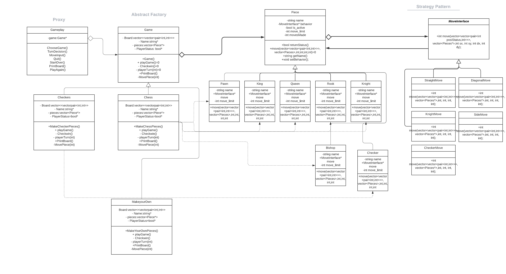

# \<Chess, Checkers, and Make Your Own Rules\>
 
  Authors: \<[Thomas Gustafson ](https://github.com/tgustafson2)[Jorge Ruiz ](https://github.com/ruiz-jorge)[Masashi Yamaguchi](https://github.com/myama048)\>
 

## Project Description
  We thought it would be interesting to implement a program that would allow users to play chess or checkers and create their own rules to play by.  This would allow users to explore how to put a new spin on an old classic. We will implement the project using C++, classes, and inheritance.  The input will be the users names, what game they want to play, potential new rules, and what moves they want to make. The output will be a visual representation of the board and pieces, prompting user input, and declaring a winner.

  Abstract Factory

  We will use Abstract Factory by implementing a generic class for the game pieces. Each piece will have generic attributes and then they will be overwritten in the concrete classes for each specific piece. This will allow for different pieces to easily be added in the future.

Strategy

  We will use Strategy by defining multiple algorithms to let users pass the algorithm to be used as a parameter. The movement of each piece can be implemented differently. Every character will have its own move() implementation. This way, there is no code reusability and we can not change the implementation at run time

  Proxy

  We will use proxy to take user decisions and act on the particular game being played. It will also give the option to create a new game or simply quit.  It will contain a pointer to the game class and implements the interface.

## Class Diagram

Our proxy pattern will be acting upon our game class that will be instatiated as one of the 3 concrete classes.  The game class will be the abstract factory, depending on which game is chosen it will create different pieces to be used.  The strategy class will take the move input and validate that the move is possible for the given piece.

 > ## Final deliverable
 > All group members will give a demo to the TA during lab time. The TA will check the demo and the project GitHub repository and ask a few questions to all the team members. 
 > Before the demo, you should do the following:
 > * Complete the sections below (i.e. Screenshots, Installation/Usage, Testing)
 > * Plan one more sprint (that you will not necessarily complete before the end of the quarter). Your In-progress and In-testing columns should be empty (you are not doing more work currently) but your TODO column should have a full sprint plan in it as you have done before. This should include any known bugs (there should be some) or new features you would like to add. These should appear as issues/cards on your Kanban board. 
 ## Screenshots
 > Screenshots of the input/output after running your application
 ## Installation/Usage
 > Instructions on installing and running your application
 ## Testing
 > How was your project tested/validated? If you used CI, you should have a "build passing" badge in this README.
 
